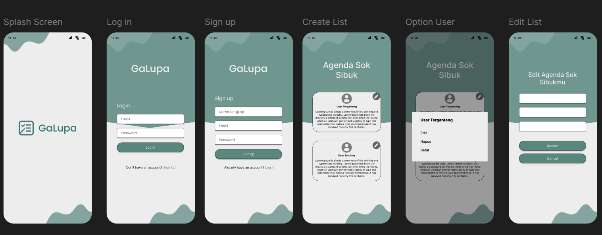

| UTS  |  Pemrograman Mobile 2  
|-------|---------
| NIM   | 312310610
| Nama  | Raul Putra Widodo
| Kelas | TI.23.A.6
| Dosen |  Donny Maulana, S.Kom., M.M.S.I.

# APLIKASI CRUD

# Aplikasi "GaLupa", merupakan aplikasi manajemen agenda atau catatan aktivitas.

### 1. **Splash Screen**
- **Fungsi**: Tampilan awal saat aplikasi dibuka.
- **Elemen**:
  - Logo aplikasi dan nama **"GaLupa"**.
  - Latar belakang putih dengan ornamen hijau bergelombang di atas dan bawah.
- **Tujuan**: Memberi identitas dan kesan pertama pada pengguna.

### 2. **Log in**
- **Fungsi**: Pengguna memasukkan email dan password untuk masuk.
- **Elemen**:
  - Judul **"GaLupa"**.
  - Field input: Email dan Password.
  - Tombol **Log in**.
  - Link ke halaman **Sign Up** untuk pengguna baru.

### 3. **Sign up**
- **Fungsi**: Pengguna baru mendaftar akun.
- **Elemen**:
  - Judul **"Sign up"**.
  - Field input: Nama lengkap, Email, dan Password.
  - Tombol **Sign up**.
  - Link ke halaman **Log in** bagi yang sudah memiliki akun.

### 4. **Create List**
- **Fungsi**: Menampilkan daftar agenda yang telah dibuat.
- **Elemen**:
  - Judul **"Agenda Sok Sibuk"**.
  - Setiap item agenda berisi:
    - Nama pengguna.
    - Deskripsi agenda (menggunakan placeholder Lorem Ipsum).
    - Ikon pensil untuk mengedit.
- **Tampilan** bersih dengan dua panel agenda yang bisa dipilih.

### 5. **Option User**
- **Fungsi**: Menampilkan opsi tindakan untuk setiap agenda.
- **Elemen**:
  - Nama pengguna (misalnya **User Terganteng**).
  - Opsi:
    - **Edit**: Untuk mengubah data agenda.
    - **Hapus**: Menghapus agenda.
    - **Batal**: Menutup opsi.

### 6. **Edit List**
- **Fungsi**: Memungkinkan pengguna mengubah isi agenda.
- **Elemen**:
  - Judul **"Edit Agenda Sok Sibukmu"**.
  - Field input: kemungkinan untuk nama, deskripsi, atau tanggal.
  - Tombol **Update** untuk menyimpan perubahan.
  - Tombol **Cancel** untuk membatalkan.

### Kesimpulan:
Aplikasi **GaLupa** memiliki alur UI yang jelas dan sederhana, dimulai dari splash screen, autentikasi pengguna, hingga manajemen daftar agenda. Desainnya konsisten dengan palet warna hijau muda dan putih, serta ornamen gelombang sebagai ciri khas visual.
